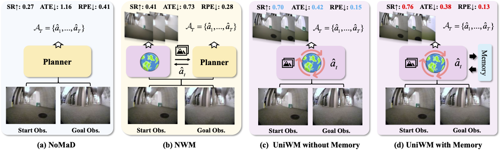

<br>
<p align="center">

<h1 align="center"><strong>🌍 Unified World Models: Memory-Augmented<br>Planning and Foresight for Visual Navigation</strong></h1>
  <p align="center"><span><a href=""></a></span>
              <a>Yifei Dong<sup>*</sup>,</a>
              <a>Fengyi Wu<sup>*</sup>,</a>
             <a>Guangyu Chen<sup>*</sup>,</a>
              <a>Zhi-Qi Cheng<sup>†</sup>,</a>
              <a>Qiyu Hu,</a>
              <a>Yuxuan Zhou,</a>
              <a>Jingdong Sun,</a>
              <a>Jun-Yan He,</a>
              <a>Qi Dai,</a>
              <a>Alexander G Hauptmann</a>
    <br>
    <sup>*</sup>Equal Contribution, <sup>†</sup>Corresponding author<br>
  </p>
    
<p align="center">
  <a href="https://arxiv.org/abs/2510.08713" target="_blank">
    
  </a>
  <a href="https://github.com/F1y1113/UniWM" target="_blank">
    
  </a>
<a href="https://github.com/F1y1113/UniWM" target="_blank">
    
</a>
</p>

<p align="center">
  
</p>

**UniWM** introduce a unified, memory-augmented world model paradigm integrating egocentric visual foresight and planning within a single multimodal autoregressive backbone. Unlike modular frameworks, UniWM explicitly grounds action decisions in visually imagined outcomes, ensuring tight alignment between visualization and planning. A hierarchical memory mechanism further integrates detailed short-term perceptual cues with longer-term trajectory context, enabling stable, coherent reasoning over extended horizons.

## Quick Start

```bash
conda create -n uniwm python=3.10
conda activate uniwm
pip install torch==2.4.0
pip install -r requirements.txt --user
```

## Implementation

### Data

We now release a partial dataset for the purpose of debugging and demonstrating the data format. You can find them in [data_samples](data_samples/)

### Training

To train the model on multiple datasets, use the following `torchrun` command. This script supports multi-GPU distributed training (we provide an example in train.sh).

```bash
torchrun --nproc_per_node={GPU_NUM_PER_NODE} train.py \
    --model anole \
    --data go_stanford,scand,sacson,recon \
    --data_dir /path/to/your/data_samples \
    --decoder_type anole \
    --image_seq_length 784 \
    --input_format anole \
    --output /path/to/save/output \
    --note {experiment_note} \
    --report_to none \
    --do_train \
    --bfloat16
```

### Evaluation

To evaluate a trained model, use the command below. The script supports several evaluation modes, which can be selected by using the appropriate flag (we provide an example in eval.sh).

``` bash
torchrun --nproc_per_node=<GPU_NUM_PER_NODE> train.py \
    --model anole \
    --model_ckpt /path/to/your/checkpoint \
    --data go_stanford,scand,sacson,recon \
    --data_dir /path/to/your/data_samples \
    --decoder_type anole \
    --image_seq_length 784 \
    --input_format anole \
    --output /path/to/save/eval_results \
    --note {experiment_note} \
    --report_to none \
    \
    # Choose ONE of the following evaluation flags for different eval mode:
    --do_single_step_eval
    # --do_task_level_eval
    # --do_rollout_eval

    # Optional: --use_memory_bank_inference
```
#### Evaluation Flags (choose one):

`--do_single_step_eval`: Evaluates the model's performance on a single step of prediction.

`--do_task_level_eval`: Evaluates the model on the full end-to-end task across an entire trajectory. You can optionally enable the memory bank mechanism by adding the `--use_memory_bank_inference` flag to the command. If this flag is omitted, the evaluation runs with the memory bank disabled.

`--do_rollout_eval`: Generates a full trajectory autoregressively (i.e., the model uses its own previous predictions and ground truth actions as input for the next step) and evaluates the result.


## Acknowledgement

We would like to thank [ANOLE](https://arxiv.org/abs/2407.06135) and [MVOT](https://arxiv.org/abs/2501.07542) for their publicly available codebase, which we referenced during the implementation of Anole training.

## 🌟 Citation

If you find this repository or our paper useful, please consider **starring** this repository and **citing** our paper:
