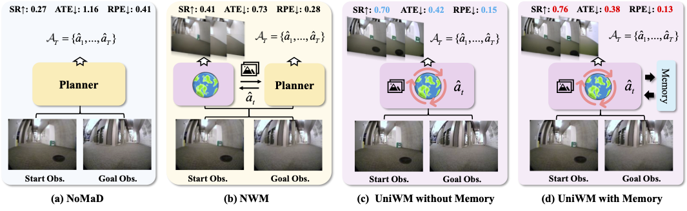

<br>
<p align="center">


<h1 align="center">🌍 Towards <ins>Uni</ins>fied <ins>W</ins>orld <ins>M</ins>odels for Visual Navigation via Memory-Augmented Planning and Foresight</h1>
<p align="center">
  <a>Yifei Dong<sup>1,*</sup>,</a>
  <a>Fengyi Wu<sup>1,*</sup>,</a>
  <a>Guangyu Chen<sup>1,*</sup>,</a>
  <a>Lingdong Kong<sup>2</sup>,</a>
  <a>Xu Zhu<sup>1</sup>,</a>
  <a>Qiyu Hu<sup>1</sup>,</a>
  <a>Yuxuan Zhou<sup>1</sup>,</a>
  <a>Jingdong Sun<sup>3</sup>,</a>
  <a>Jun-Yan He<sup>1</sup>,</a>
  <a>Qi Dai<sup>4</sup>,</a>
  <a>Alexander G. Hauptmann<sup>5</sup>,</a>
  <a>Zhi-Qi Cheng<sup>1,†</sup></a>
  <br>
  <sup>1</sup>UW, <sup>2</sup>NUS, <sup>3</sup>Apple, <sup>4</sup>Microsoft Research, <sup>5</sup>CMU
</p>
    
<p align="center">
  <a href="https://arxiv.org/abs/2510.08713" target="_blank">
    
  </a>
  <a href="https://github.com/F1y1113/UniWM" target="_blank">
    
  </a>
  <a href="https://huggingface.co/datasets/fly1113/UniWM_Dataset" target="_blank">
    
  </a>
  <a href="https://github.com/F1y1113/UniWM" target="_blank">
    
  </a>
</p>


<p align="center">
  
</p>

**UniWM** introduce a unified, memory-augmented world model paradigm integrating egocentric visual foresight and planning within a single multimodal autoregressive backbone. Unlike modular frameworks, UniWM explicitly grounds action decisions in visually imagined outcomes, ensuring tight alignment between visualization and planning. A hierarchical memory mechanism further integrates detailed short-term perceptual cues with longer-term trajectory context, enabling stable, coherent reasoning over extended horizons.

You are also welcome to explore our previous work, including [**GOViG**](https://github.com/F1y1113/GoViG), which introduces a new task that we leverage multimodal LLM reasoning to generate navigation instructions directly from egocentric visual observations of the initial and goal states and [**HA-VLN**](https://github.com/F1y1113/HA-VLN/), where we introduce HA-VLN 2.0, a unified benchmark coupling discrete (DE) and continuous (CE) navigation paradigms with explicit social-awareness constraints.

## Quick Start

```bash
conda create -n uniwm python=3.10 -y
conda activate uniwm
bash install.sh
```

## Implementation

### Data

We host the UniWM dataset on Hugging Face: [`fly1113/UniWM_Dataset`](https://huggingface.co/datasets/fly1113/UniWM_Dataset). 

- [`go_stanford`](https://huggingface.co/datasets/fly1113/UniWM_Dataset/resolve/main/go_stanford.tar), [`recon`](https://huggingface.co/datasets/fly1113/UniWM_Dataset/resolve/main/recon.tar), [`sacson`](https://huggingface.co/datasets/fly1113/UniWM_Dataset/resolve/main/sacson.tar), [`scand`](https://huggingface.co/datasets/fly1113/UniWM_Dataset/resolve/main/scand.tar) used for both training and evaluation.
- [`tartandrive`](https://huggingface.co/datasets/fly1113/UniWM_Dataset/resolve/main/tartandrive.tar) reserved for unseen evaluation only.

To download and extract all splits into `data/` with a single command:

```bash
bash download_data.sh
```

After extraction, the directory structure will look like:

```
data/
├── go_stanford/
│   ├── traj_0000/
│   │   ├── 0.jpg
│   │   ├── 1.jpg
│   │   ├── ...
│   │   ├── n.jpg
│   │   └── traj_data.pkl
│   ├── traj_0001/
│   └── ...
└── ...
```

Each `traj_xxxx/` folder contains a sequence of egocentric frames (`0.jpg`, `1.jpg`, ..., `n.jpg`) and a `traj_data.pkl` file storing the per-step metadata (e.g., actions, poses) for that trajectory. The other splits follow the same layout.


### Training

To train the model on multiple datasets, use the following `torchrun` command. This script supports multi-GPU distributed training (we provide an example in train.sh).

```bash
torchrun --nproc_per_node={GPU_NUM_PER_NODE} train.py \
    --model anole \
    --data go_stanford,scand,sacson,recon \
    --data_dir ./data \
    --decoder_type anole \
    --image_seq_length 784 \
    --input_format anole \
    --output /path/to/save/output \
    --note {experiment_note} \
    --report_to none \
    --do_train \
    --bfloat16
```

### Evaluation

To evaluate a trained model, use the command below. The script supports several evaluation modes, which can be selected by using the appropriate flag (we provide an example in eval.sh).

``` bash
torchrun --nproc_per_node=<GPU_NUM_PER_NODE> train.py \
    --model anole \
    --model_ckpt /path/to/your/checkpoint \
    --data go_stanford,scand,sacson,recon \
    --data_dir ./data \
    --decoder_type anole \
    --image_seq_length 784 \
    --input_format anole \
    --output /path/to/save/eval_results \
    --note {experiment_note} \
    --report_to none \
    \
    # Choose ONE of the following evaluation flags for different eval mode:
    --do_single_step_eval
    # --do_task_level_eval
    # --do_rollout_eval

    # Optional: --use_memory_bank_inference
```
#### Evaluation Flags (choose one):

`--do_single_step_eval`: Evaluates the model's performance on a single step of prediction.

`--do_task_level_eval`: Evaluates the model on the full end-to-end task across an entire trajectory. You can optionally enable the memory bank mechanism by adding the `--use_memory_bank_inference` flag to the command. If this flag is omitted, the evaluation runs with the memory bank disabled.

`--do_rollout_eval`: Generates a full trajectory autoregressively (i.e., the model uses its own previous predictions and ground truth actions as input for the next step) and evaluates the result.

## Contributing

We welcome contributions to this project! Please contact yfeidong@uw.edu or fyiwu@uw.edu.

## Acknowledgement

We would like to thank [ANOLE](https://arxiv.org/abs/2407.06135) and [MVOT](https://arxiv.org/abs/2501.07542) for their publicly available codebase, which we referenced during the implementation of Anole training.

## 🌟 Citation

If you find this repository or our paper useful, please consider **starring** this repository and **citing** our paper:
```bibtex
@misc{dong2026unifiedworldmodelsvisual,
      title={Towards Unified World Models for Visual Navigation via Memory-Augmented Planning and Foresight}, 
      author={Yifei Dong and Fengyi Wu and Guangyu Chen and Lingdong Kong and Xu Zhu and Qiyu Hu and Yuxuan Zhou and Jingdong Sun and Jun-Yan He and Qi Dai and Alexander G. Hauptmann and Zhi-Qi Cheng},
      year={2026},
      eprint={2510.08713},
      archivePrefix={arXiv},
      primaryClass={cs.AI},
      url={https://arxiv.org/abs/2510.08713}, 
}
```
